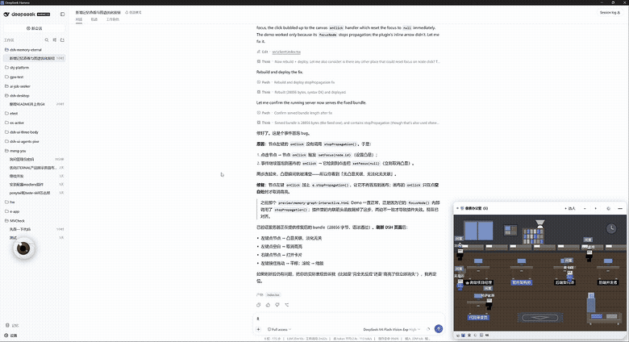
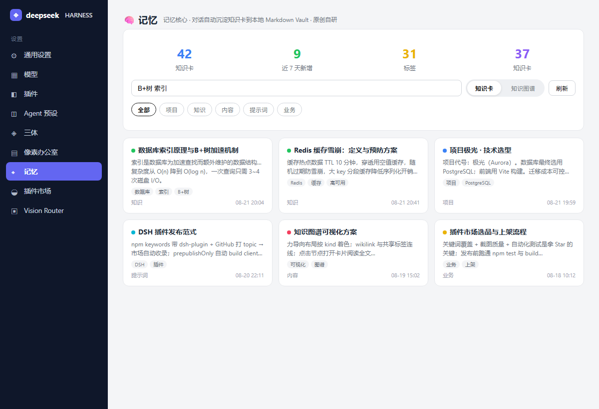
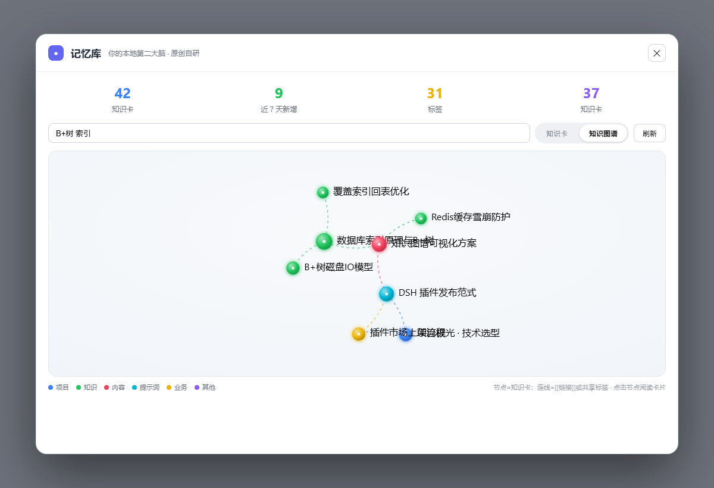
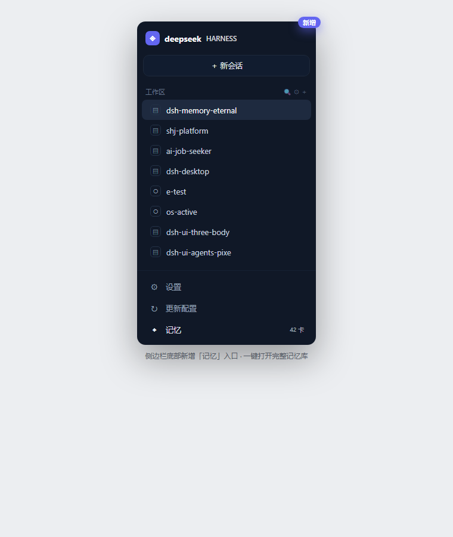

# 记忆核心（dsh-memory-eternal）

> 🧠 **给 DeepSeek Harness 装上「第二大脑」**：一款**自研独立**的 DSH 记忆插件，为任意 DeepSeek Harness 提供对话级长期记忆——对话结束后**自动**把值得长期复用的内容压缩成知识卡，写入本地 Markdown Vault（自研去重、自研 CJK 检索、可 git 管理）；设置页提供**图形化知识库**：统计概览、CJK 检索、知识卡网格、自研知识图谱。Agent 通过 `memory_recall` 工具按需召回历史上下文。**一条命令安装，零人工干预，不改 dsh 源码。**

---

<p align="center">
  
  <br/>
  <em>记忆核心 · 对话自动沉淀 + 图形化知识库 + 增强知识图谱（动态演示）</em>
</p>

<p align="center">
  
  <br/>
  <em>设置 → 记忆：统计概览、CJK 检索、知识卡网格、按 kind 分类（「知识卡 / 知识图谱」Tab 一键切换）</em>
</p>

<p align="center">
  
  <br/>
  <em>侧边栏底部「记忆」按钮 → 一键打开<strong>完整记忆库弹窗</strong>：更开阔的查看体验 + 增强版知识图谱</em>
</p>

<p align="center">
  
  <br/>
  <em>侧边栏底部新增「记忆」入口（位于「设置 / 更新配置」下方），一键直达知识库</em>
</p>

---

## ✨ 为什么值得装

| 亮点 | 说明 |
| --- | --- |
| 🧬 **原创自研** | 去重 / CJK 检索 / 知识图谱 / 图形化界面均由本仓库**独立实现**；运行时**不依赖**任何第三方记忆框架，核心逻辑可在 `lib/` 逐行核对 |
| 🤖 **全自动沉淀** | 每轮对话结束自动触发（监听 `agent/turn-stopping`），模型判定「是否值得保存」并压缩成 300-800 字知识卡——**无需任何手动操作** |
| 📚 **本地 Markdown Vault** | 知识卡是带 frontmatter 的普通 `.md` 文件，默认落在 `~/.dsh/memory-vault`，可手动编辑、可 git 版本管理、可被任何工具读取，不锁进私有数据库 |
| 🚫 **智能去重** | 双层去重：**自研词法 Jaccard bigram**（0.62 阈值）+ **语义去重**（把已有卡片索引喂给模型，由模型决定「新建 vs 追加到已有卡」，对 LLM 改写免疫） |
| 🔍 **CJK 感知检索** | 中文整词 + 字符 bigram 命中，短查询「强化学习」「蒸馏」也能在长文里命中，无需全文搜索引擎 |
| 🕸 **知识图谱** | 卡片间的 `[[wikilink]]` 与共享标签自动连线，SVG 图谱左键凸显关联、右键打开卡片阅读 |
| 🧠 **自动召回** | 注入 system prompt 告知 Agent 它拥有记忆核心，并注册 `memory_recall` 工具——需要项目背景/历史决策/领域知识时自动检索 |
| 🔒 **本地优先** | 所有内容留在你的本机 Vault；不设遥测、不传云端。模型请求仍走你已配置好的 provider |
| ⚙️ **一键安装** | 与 `dsh-ui-three-body` 同款插件机制，`npx @deepseek-ai/dsh plugin add dsh-memory-eternal` 即可 |

**适合**：想要让 DSH 记住项目背景与历史决策的人 / 想给对话沉淀可检索知识库的人 / Obsidian 式 Markdown Vault 爱好者 / 在意数据归属（本地文件 > 云端数据库）的人。

---

## 🚀 安装

```bash
# 已发布后（npm）
npx @deepseek-ai/dsh plugin --profile web add dsh-memory-eternal

# 从 GitHub
npx @deepseek-ai/dsh plugin --profile web add github:EternalNight996/dsh-memory-eternal

# 本地联调（link 本地目录，改代码即时生效）
npx @deepseek-ai/dsh plugin --profile web add F:/MyApp/eternal/dsh-memory-eternal
```

装完**重启 dsh web**：设置 → 记忆 出现知识库页面；侧边栏底部也会出现「记忆」按钮，一键打开完整记忆库弹窗。此后每轮对话自动沉淀知识卡。

---

## 🧠 自动沉淀（零人工干预）

对话每轮结束 → 插件提取增量消息 → 调用当前模型压缩 → 双层去重 → 写入 Vault：

```
你的对话
   │
   ▼
agent/turn-stopping ──► 提取本轮 user/assistant 消息
   │
   ▼
LLM 判定（值得保存？）──否──► 丢弃
   │是
   ▼
语义去重（喂给模型已有卡片索引）
   ├─ 同一主题 ──► append_to：追加「更新记录」到已有卡（不建重复卡）
   └─ 新主题 ────► 写新知识卡到 02-06 对应目录
```

知识卡格式（frontmatter + markdown 正文）：

```markdown
---
kind: knowledge
title: 数据库索引原理与B+树加速机制
tags: [数据库, 索引, B+树, 查询优化]
created: 2026-08-21T12:01:51.636Z
updated: 2026-08-21T12:01:51.636Z
source: session:session-xxxx
---
# 数据库索引原理与B+树加速机制

## 核心定义
- 索引是数据库为加速查找而额外维护的数据结构...
```

Vault 目录结构：

```
~/.dsh/memory-vault/
├── 00-System/          # 系统（未来扩展：Active-Context 等）
├── 02-Projects/        # 项目背景 / 进度
├── 03-Knowledge/       # 通用知识 / 技术方案 / 设计决策（默认）
├── 04-Content/         # 内容素材 / 资料
├── 05-Prompts/         # 提示词 / 工作流
└── 06-Business/        # 业务 / 商业
```

## 🕸 图形化知识库（设置 → 记忆 + 侧边栏「记忆」入口）

- **双入口**：设置 → 记忆 页 + 侧边栏底部「记忆」按钮（一键打开完整记忆库弹窗）
- **统计概览**：总卡数、近 7 天新增、标签数、知识卡数
- **检索**：中文片段即时搜索（280ms 防抖）
- **知识卡网格**：kind 筛选（全部/项目/知识/内容/提示词/业务），点击卡片阅读全文（frontmatter 一并展示）
- **知识图谱（增强版）**：力导向有机布局（大规模自动切**径向布局** + 节点/连线上限 + 标签节流，**几千节点不卡**）；节点 = 知识卡（按 kind 渐变+发光着色、按连接数自动放大）；连线 = `[[wikilink]]` 或共享标签（曲线渐变 + 流动动画）；**滚轮缩放、按住左键拖动画布**、**左键凸显关联节点并淡化无关节点**、**右键打开卡片**、悬停高亮

## 🔧 设置

| 设置项 | 默认 | 说明 |
| --- | --- | --- |
| 启用 | 开 | 总开关 |
| 自动沉淀 | 开 | 每轮对话结束自动捕获 |
| 自动召回 | 开 | 注入 system prompt + `memory_recall` 工具 |
| 记忆库目录 | 空 | 留空 = `~/.dsh/memory-vault`；可指向任意目录（如 Obsidian Vault） |
| 去重阈值 | 0.62 | 词法去重 Jaccard 相似度阈值（自研默认值） |
| 捕获最小长度 | 200 | 少于该字符数的对话不触发捕获 |
| 日配额 | 60 | 每天最多自动写卡数，防止烧 token |

## 🛠 开发 / 构建 / 测试

```bash
npm i
npm test        # 29 个单元测试：vault 去重/检索/图谱 + capture 管线 + API 形状
npm run build   # 打包 client（改 src/client 后需要；改 index.js / lib 无需构建）
```

目录结构：

```
dsh-memory-eternal/
├── index.js             # host 半边：设置 + turn-stopping 钩子 + 工具 + JSON API
├── lib/
│   ├── vault.js         # Markdown Vault 存储层（frontmatter/去重/检索/图谱，纯 Node 可单测）
│   └── capture.js       # 自动沉淀管线（LLM 压缩 + 语义去重）
├── src/client/index.tsx # client 半边：设置页 + 侧边栏「记忆」按钮 + 完整记忆库弹窗（统计/搜索/卡片/图谱）
├── build.mjs            # esbuild 打包 client → lib/client.js
├── cordis.patch.yml     # bundle 补丁层（自动挂载 host 行）
└── tests/               # node:test 单测
```

## 🗺 Roadmap / 待办

- [x] 对话自动沉淀（turn-stopping 钩子 + LLM 压缩 + 双层去重）
- [x] CJK 感知检索 + 本地 Markdown Vault（02-06 分类 + frontmatter）
- [x] `memory_recall` 自动召回工具 + system prompt 分段
- [x] 图形化知识库：统计 / 检索 / 知识卡网格
- [x] 侧边栏「记忆」按钮 + 完整记忆库弹窗
- [x] 增强知识图谱：力导向/径向布局、滚轮缩放、左键拖拽、右键凸显关联、大规模抗压
- [ ] 每日记忆回顾 + 用量统计
- [ ] 多语言模板与自定义去重规则
- [ ] 卡片批量导入 / 导出 / 拖拽归类

## 📦 发布记录

- **v0.2.0**：新增侧边栏「记忆」入口 + 完整记忆库弹窗；增强知识图谱（力导向/径向布局、滚轮缩放、左键拖拽平移、左键凸显关联/右键打开卡片、大规模抗压：节点/连线上限 + 标签节流 + O(n) 径向布局）；README 头部动态演示 GIF。
- **v0.1.0**：首个可用版本。对话自动沉淀（turn-stopping 钩子 + LLM 压缩 + 双层去重）、`memory_recall` 工具、system prompt 召回段、Markdown Vault（02-06 分类 + frontmatter）、CJK 检索、自研知识图谱、设置页图形化知识库。

## 📄 License

MIT

---

> 让 DSH 拥有第二大脑：**对话自动沉淀，知识随手可查。** 🧠
