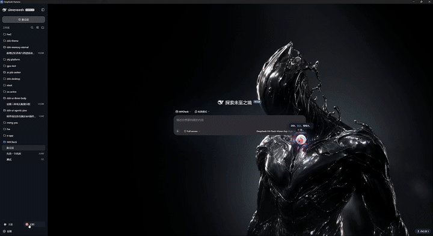
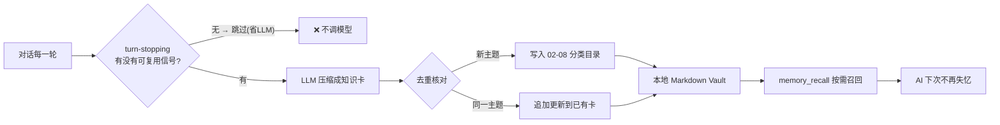

# 🧠 记忆核心 dsh-memory-eternal — 给 DeepSeek Harness 装上「第二大脑」

<p align="center">
  
  
  
  
  
</p>

> **对话结束自动沉淀，跨会话真实不失忆；召回只取相关小块，省 token、少噪音。**
> 全自研、零第三方记忆框架、不改 DSH 源码、一条命令安装——为你装一个「自己说了算」的、可 git 管理的本地记忆库。

<p align="center"><strong>⭐ 觉得好用就点个 Star</strong>，让更多被「AI 总忘事」困扰的人用上它。<br/><sub>一条命令：<code>dsh plugin --profile web add dsh-memory-eternal</code></sub></p>

---

<p align="center">
  
  <br/><em>对话自动沉淀 · 图形化知识库 · 交互式知识图谱（动态演示）</em>
</p>

---

## 🔥 先看痛点：AI 助手为什么「总让人失望」？

| # | 痛点（每个用 AGENT 的人都遇到过） | 没有记忆的后果 |
|---|---|---|
| 1 | **长对话就忘事** | 聊到第 10 轮，前面定的方案、改的口径全忘了，反复重来 |
| 2 | **跨会话失忆** | 换新会话 = 白纸一张，项目背景要重新讲一遍 |
| 3 | **长会话 token 暴涨** | 上下文越来越长，越聊越贵、越聊越慢，甚至爆窗 |
| 4 | **存了却找不到** | 就算有笔记，也搜不到、管不好，等于没存 |
| 5 | **数据被锁死** | 记忆存在私有库里，改不了、导不出、不敢用 |

> 这不是你的错觉，是**绝大多数 AI 产品共通的硬伤**。而解法，正是 Agent 记忆——**总结 → 存储 → 按需召回**。

---

## 🚀 装上它之后：五道痛点逐一被解决

| 痛点 | 装上记忆核心后 | 靠什么实现 |
|---|---|---|
| ① 长对话忘事 | 保留「最近原文」，旧轮次自动总结成卡 | 自动沉淀 + 语义去重 |
| ② 跨会话失忆 | 新会话也能召回旧决策/方案 | `memory_recall` 按需召回 |
| ③ 长会话 token | **只召回相关小块**，不每轮全量塞 | 相关性阈值 + 片段截断 + 沉淀预筛 |
| ④ 存了找不到 | 中文整词+bigram 检索 + 可视化图谱 | CJK 感知检索 + 知识图谱 |
| ⑤ 数据被锁死 | 纯 Markdown，可读可改可 git 托管 | 本地 Markdown Vault |



---

## 🧬 核心内核设计：为什么要「全自研」

市面上记忆方案很多，但大多**依赖第三方框架 / 动不动就起一个 MCP 服务 / 把记忆锁进私有库**。本插件把「记忆骨架」整个自己搭出来，**零第三方运行时依赖**，逻辑能逐行看懂：

| 模块 | 自研实现 | 替代什么 |
|---|---|---|
| **去重** | 词法 Jaccard bigram（0.62）+ **语义去重**（把已有卡索引喂模型，让它决定「新建 vs 追加」） | 防重复、防 LLM 改写导致的垃圾卡 |
| **检索** | CJK 感知：中文整词 + 字符 bigram 命中 | 无需全文搜索引擎，短查询也能命中长文 |
| **图谱** | 力导向/径向布局 + `[[wikilink]]`/共享标签/相似度连边 | 让「知识之间怎么关联」一眼看清 |
| **存储** | 带 frontmatter 的普通 `.md`，落盘 `~/.dsh/memory-vault` | 不锁库、可读、可 git、可被任意工具读 |

> **与其他热门记忆项目的思路同向（总结→存储→按需召回），但定位不同。** 参考同类热门思路，本插件主打「**本地、自研、零依赖、可读可控**」：

| 热门项目 | 定位 | 本插件的差异 |
|---|---|---|
| [agentmemory](https://github.com/rohitg00/agentmemory) | 通用 Agent 记忆服务 | 本插件是 **DSH 原生插件**，不另起服务，直接进设置/侧边栏 |
| [mem0](https://github.com/mem0ai/mem0) | 记忆层（常配 MCP） | 本插件**无 MCP 依赖**，离线可跑，走本地 `memory_recall` 工具 |
| [MemGPT / Letta](https://github.com/letta-ai/letta) | 上下文内存管理 | 本插件承载「**持久记忆**」这一层；会话内实时压缩属 harness 层 |
| **[Zep](https://github.com/getzep/zep)** | 时间/图记忆 | 本插件零外部服务，图谱/检索纯本地 |

> 如果你已在用其中某一层，也完全能把本插件当「**本地持久记忆底座**」叠加使用——它只消费你已配置好的 provider，不抢模型、不改你的习惯。

---

## ✨ 功能总览（交互全在这里）

<details>
<summary><b>📇 知识卡：存得进、找得到、管得了</b></summary>

- **全自动沉淀**：每轮结束自动判定+压缩成 300-800 字知识卡，无需手动保存
- **双层去重**：Jaccard 词法 + 语义追加，不堆重复卡
- **`.md` 全文**：frontmatter 里带 `kind/title/tags/created/updated`，就是普通 Markdown
- **Markdown 渲染**、**长卡折叠**、**新卡「新」角标**、**搜索命中高亮**、**卡片行删除**
- **无限滚动懒加载**、自定义**滚动条**配色
- 排序：**最近 / 标题 / 热点（按连接数）**

</details>

<details>
<summary><b>🕸 知识图谱：秒级看懂「知识之间的关系」</b></summary>

- **力导向/径向混合布局**：按 kind 分扇区、枢纽在内圈、环间距不重叠，数量大也不乱；**几千节点不卡**
- 连线 = `[[wikilink]]` / 共享标签 / **相似度关联**；只保留**高影响力主干边**避免毛球
- 交互：**左键凸显关联**、**右键菜单**（打开/凸显/复制/删除）、**Shift 框选多选**（导出/删除/合并）、**图例过滤**、**时间维着色**（3天内绿/2周琥珀/1月橙/更早灰蓝）、**滚轮缩放**、**导图 PNG**（下载/另存为/复制/全屏）

</details>

<details>
<summary><b>💾 备份与控制：数据永远是你的</b></summary>

- 记忆库**导出 MD / JSON**、**导入**（自动去重）
- 导出可选**默认下载**或**自选位置**另存为
- 所有操作**顶部醒目 toast**：✓ 绿 = 成功、✕ 红 = 失败，并显示导出位置/文件名
- 可指向任意目录（如 Obsidian Vault）
</details>

<p align="center">
  
  <br/><em>设置 → 记忆：统计概览、CJK 检索、知识卡网格、按 kind 分类</em>
</p>
<p align="center">
  
  <br/><em>侧边栏底部「记忆」按钮 → 一键打开完整记忆库弹窗（含增强知识图谱）</em>
</p>

---

## 🚀 安装（一条命令）

```bash
# 已发布后（npm）—— 跨平台通用
dsh plugin --profile web add dsh-memory-eternal

# 从 GitHub
dsh plugin --profile web add github:EternalNight996/dsh-memory-eternal

# 本地联调（改代码即时生效）
dsh plugin --profile web add F:/MyApp/eternal/dsh-memory-eternal
```

> 提示：
> - `dsh` 为 DSH CLI（`npm i -g @deepseek-ai/dsh`）。
> - 要**官方最新**（避免 npmmirror 滞后）：`npm_config_registry=https://registry.npmjs.org/ dsh plugin --profile web add dsh-memory-eternal`。
> - **profile 是 pnpm workspace**：`cd ~/.dsh/profiles/web && pnpm add dsh-memory-eternal@latest`（`npm install` 会报 `EUNSUPPORTEDPROTOCOL`）。

装完**重启 dsh web**：设置 → 记忆 出现知识库；侧边栏底部出现「记忆」按钮。此后每轮对话自动沉淀。

### 🧭 插件发现 / 收录标准

仓库已打 **GitHub `dsh-plugin` topic** 并符合社区标准结构，**自动被以下机制发现**（无需手动 PR）：

| 机制 | 收录方式 | 状态 |
|---|---|---|
| **dsh-marketplace**（ouyangyipeng） | 实时读 `topic:dsh-plugin` | ✅ topic 已打 |
| **dsh-find-plugin**（awesome-dsh-plugin） | 会话内按 topic+星数搜索 | ✅ |
| **dsh-plugin-marketplace**（YELEBAI） | 每 2h 自动扫描 + 静态验证进入 Registry | ✅ 已声明 `dsh.marketplace` 元数据 |
| **dsh-market**（2BingLing） | 提交 Issue | ✅ 已提 |
| **awesome-dsh-plugin** | 提交 PR | ✅ 已提 |

---

## 🔧 设置

| 设置项 | 默认 | 说明 |
|---|---|---|
| 启用 | 开 | 总开关 |
| 自动沉淀 | 开 | 每轮对话结束自动捕获 |
| 自动召回 | 开 | 注入 system prompt + `memory_recall` 工具 |
| 记忆库目录 | 空 | 留空 = `~/.dsh/memory-vault`；可指向任意目录（如 Obsidian Vault） |
| 去重阈值 | 0.62 | 词法去重 Jaccard 相似度阈值 |
| 捕获最小长度 | 200 | 少于该字符数不触发捕获 |
| 日配额 | 60 | 每天最多自动写卡数，防止烧 token |

---

## 🛠 开发 / 构建 / 测试

```bash
npm i
npm test        # 单元测试：vault 去重/检索/图谱 + capture 管线 + API 形状
npm run build   # 打包 client（改 src/client 后需要；改 index.js / lib 无需构建）
```

```
dsh-memory-eternal/
├── index.js             # host：设置 + turn-stopping 钩子 + 工具 + JSON API
├── lib/
│   ├── vault.js         # 存储层（frontmatter/去重/检索/图谱）
│   └── capture.js       # 自动沉淀管线（LLM 压缩 + 语义去重 + 预筛）
├── src/client/index.tsx # client：设置页 + 侧边栏「记忆」+ 完整记忆库弹窗
├── build.mjs            # esbuild 打包 client → lib/client.js
├── cordis.patch.yml     # bundle 补丁层（自动挂载 host 行）
└── tests/               # node:test 单测
```

---

## 🗺 Roadmap / 待办（记忆侧核心优化）

**已实现**：
- 自动沉淀 + 双层去重 + 日配额
- CJK 检索 + 图谱 + 召回工具
- 交互图谱（图例/时间维/框选/删除合并/导出）
- 知识卡管理（MD渲染/折叠/新角标/搜索高亮/无限滚动）
- 备份导入导出（MD/JSON）
- **沉淀预筛**（skip LLM）+ **召回相关性/截断**（v0.4.3）

**待办（核心功能优化）**：
- [ ] **上下文压缩**：把「加法记忆」升级为「召回替代 + 会话内压缩」（需 harness 配合，记忆侧提供压缩产物接口）
- [ ] **会话级 token 预算**：逼近阈值触发压缩/轮换，而非每轮 LLM
- [ ] **语义召回升级**：可选 embedding（默认零依赖 bigram + LLM 判定兜底），召回更精
- [ ] **多 Vault / 多 Profile**：按项目/场景分库，互不干扰
- [ ] **自动归档整理**：低频大扫除，合并同类、标记陈旧（非破坏性，先预览）
- [ ] **注入体积可配置**：每卡摘要长度、召回条数、是否带正文，做成设置项
- [ ] **召回用户反馈**：对命中结果「有用/无关」打标，逐步调优相关性
- [ ] **每日记忆回顾**：一键回顾当天沉淀 + 用量统计

---

## 📦 发布记录

- **v0.4.3**：记忆侧**省 token/提质量**——沉淀预筛（无可复用信号直接跳过、不触发 LLM）；召回按 `minScore` 过滤弱命中、注入片段截断到 130 字。
- **v0.4.2**：修复 GitHub/npm 顶部演示 GIF 无法显示（压缩至 README 10MB 阈值以下，8MB）。
- **v0.4.1**：Marketplace 收录标准落地（`dsh.marketplace` 元数据 + 自动扫描规则说明）。
- **v0.4.0**：图谱交互全面增强（图例过滤/时间维/右键菜单/框选/删除合并/导出PNG另存自选位置）+ 知识卡增强（MD渲染/长卡折叠/新角标/搜索高亮/删除/无限滚动）+ 相似度关联 + 导入导出 + 顶部绿红 toast。
- **v0.3.0**：知识图谱科学布局（多环径向/主干边/默认仅枢纽标签/大图关发光）。
- **v0.2.x**：GitHub 源安装修复、安装说明跨平台化/去 npx、分类扩展（工具/教训）、peer 依赖放宽。
- **v0.1.0**：首个可用版本（自动沉淀 + 召回工具 + Markdown Vault + CJK 检索 + 图谱 + 设置页）。

---

## 📄 License

MIT

---

> **让 DSH 真正记住你：对话自动沉淀，知识随手可查。**　⭐ 觉得有用就点个 Star，Let's make AI not forget.
